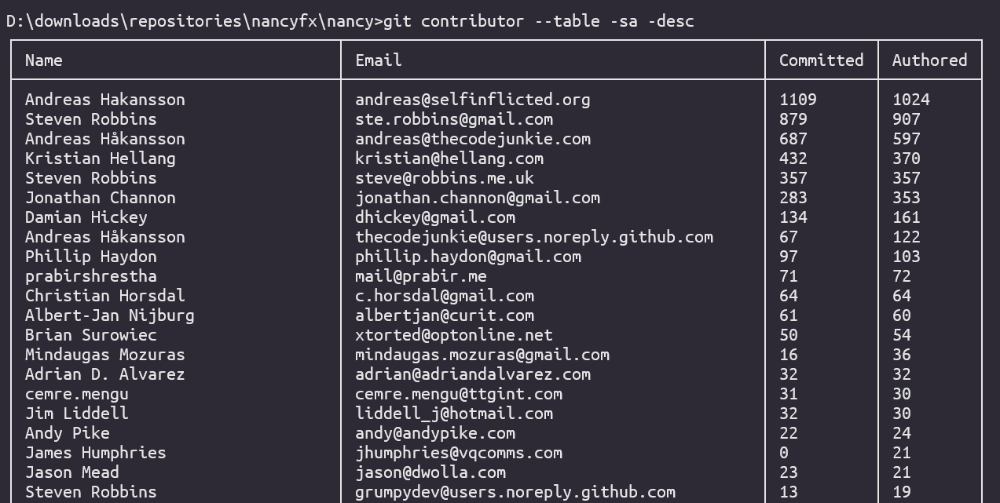
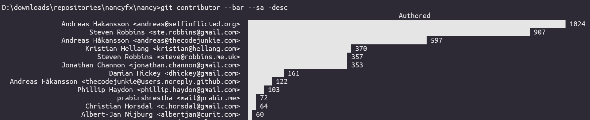
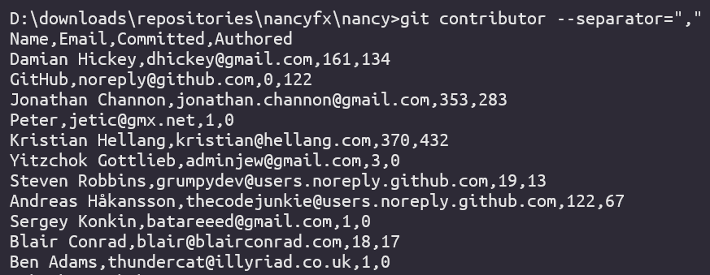

# Git-Contributor

`git-contributor` is a commandline tool which is supposed to be installed as a `dotnet global tool`.

You can find out more about [dotnet global and locals tools here](https://docs.microsoft.com/en-us/dotnet/core/tools/global-tools).

## Examples
- Execute `git-contributor`
```
git-contributor
```
to display a list of all contributors whose commits are reachable over HEAD.

- Or display a table of the contributors, e.g. by executing:
```
git-contributors --table -sa
```
To display the contributors inside a table.


- Or display a barchart of the contributors, e.g. by executing:
```
git-contributors --barchart
```


- Pseude CSV (not escaping separators yet)
```
git-contributor --separator=","
```


- Use git submodule support (no '-' between git and contributor)
```
git contributor
```

- Display Usage info
```
git-contributor -h
```

## Why install as a dotnet global tool?
- Dotnet tools when installed  globally, are added to your PATH variable automatically, which makes them available over the commandline everywhere.

- When you execute `git foobar` git will look for an executable called `git-foobar` in your path and execute it with the remaining arguments forwarded. You can read more about [git subcommands here](https://gitirc.eu/howto/new-command.html).

## Building & Install
To build and install as `dotnet global tool` do the following steps.

1. Build as a dotnet global tool
```
dotnet pack -c Release
```
or execute `pack.cmd` on windows which does exactly that.

2. Install
```
dotnet tool install --global --add-source ./src/GitContributors/nupkg GitContributors
```
or execute `install.cmd` on windows which does exactly that.

## Update
1. Rebuild with `dotnet pack -c Release` like previously
2. Update
```
dotnet tool update --global --add-source ./src/GitContributors/nupkg GitContributors
```

## Usage
Get usage info by executing `git-contributor -h`
```
git-contributor v0.1.0 written by Martin Kramer / www.lostindetails.com / http://github.com/8/git-contributors
      --directory, -d=VALUE  Sets the path to the git directory, (default: '')
      --help, -h, -?         Shows this help description.
      --mailmap-file, -f=VALUE
                             Sets the mailmap file, default: .mailmap
      --sort-direction, --sort-dir=VALUE
                             Specify the SortDirection, possible values are '
                               asc' or 'desc'
      --sort-desc, --desc    Sorts contributors in descending order
      --sort-asc, --asc      Sorts contributors in ascending order
      --sort-name, --sn      Sorts contributors by Name
      --sort-email, --se     Sorts contributors by Email
      --sort-authored, --sa  Sorts contributors by the number of authored
                               commits
      --sort-committed, --sc Sorts contributors by the number of committed
                               commits
      --format=VALUE         Selects the output format. Options: 'stdio (
                               default), table, barchar'
      --table                Selects output format 'table'
      --barchar, --bar       Selects output format 'barchart'
      --stdio                Selects output format 'stdio'
      --separator, --sep=VALUE
                             Sets the separator used for stdio output
```

## Special Thanks
- [Spectre.Console](https://spectreconsole.net) <- Table + BarChart

## Todo
- [ ] Get it working on WSL / Linux
- [ ] Implement real csv export
- [ ] Support other commit origins than HEAD