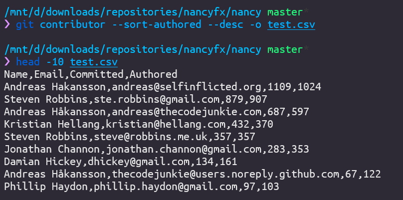
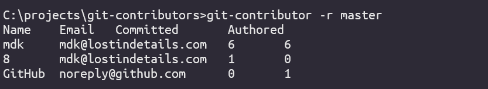
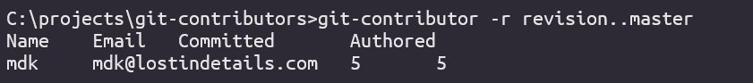

# Git-Contributor

`git-contributor` is a commandline tool which is supposed to be installed as a `dotnet global tool`.

You can find out more about [dotnet global and locals tools here](https://docs.microsoft.com/en-us/dotnet/core/tools/global-tools).

## Getting Started
1. Install git-contributor as a dotnet global tool:
```
dotnet tool install -g GitContributors
```

2. In a git repository, execute:
```
git contributor
```

And you should get an output similar to:
```
Name    Email   Committed       Authored
MartinK mdk@lostindetails.com   1       0
8       mdk@lostindetails.com   3       0
GitHub  noreply@github.com      0       4
mdk     mdk@lostindetails.com   12      12
```

## Examples
- Execute `git-contributor`
  ```
  git-contributor
  ```
  to display a list of all contributors whose commits are reachable over HEAD.

- Or display a table of the contributors, e.g. by executing:
  ```
  git-contributors --table -sa
  ```
  To display the contributors inside a table.
  

- Or display a barchart of the contributors, e.g. by executing:
  ```
  git-contributors --barchart
  ```
  

- Or Export as CSV
  ```
  git-contributor -o test.csv
  ```
  

- Filter by branch / tag / commit hash
  ```
  git-contributor -r master
  ```
  

- Filter by range
  ```
  git-contributor -r revision..master
  ```
  

- Use git submodule support (no '-' between git and contributor)
  ```
  git contributor
  ```

- Display Usage info
  ```
  git-contributor -h
  ```

## Why install as a dotnet global tool?
- Dotnet tools when installed  globally, are added to your PATH variable automatically, which makes them available over the commandline everywhere.

- When you execute `git foobar` git will look for an executable called `git-foobar` in your path and execute it with the remaining arguments forwarded. You can read more about [git subcommands here](https://gitirc.eu/howto/new-command.html).

## Building & Install
To build and install as `dotnet global tool` do the following steps.

1. Build as a dotnet global tool
```
dotnet pack -c Release
```
or execute `pack.cmd` on windows which does exactly that.

2. Install
```
dotnet tool install --global --add-source ./src/GitContributors/nupkg GitContributors
```
or execute `install.cmd` on windows which does exactly that.

## Update
1. Rebuild with `dotnet pack -c Release` like previously
2. Update
```
dotnet tool update --global --add-source ./src/GitContributors/nupkg GitContributors
```

## Usage
Get usage info by executing `git-contributor -h`
```
git-contributor v0.5.0 written by Martin Kramer / www.lostindetails.com / http://github.com/8/git-contributor
s
      --directory, -d=VALUE  Sets the path to the git directory, (default: '')
      --help, -h, -?         Shows this help description.
      --mailmap-file, -f=VALUE
                             Sets the mailmap file, default: .mailmap
      --sort-direction, --sort-dir=VALUE
                             Specify the SortDirection, possible values are '
                               asc' or 'desc'
      --sort-desc, --desc    Sorts contributors in descending order
      --sort-asc, --asc      Sorts contributors in ascending order
      --sort-name, --sn      Sorts contributors by Name
      --sort-email, --se     Sorts contributors by Email
      --sort-authored, --sa  Sorts contributors by the number of authored
                               commits
      --sort-committed, --sc Sorts contributors by the number of committed
                               commits
      --format=VALUE         Selects the output format. Options: 'stdio (
                               default), table, barchart or csv'
      --table                Selects output format 'table'
      --barchar, --bar       Selects output format 'barchart'
      --csv                  Selects output format 'csv'
      --output, -o=VALUE     Csv Output filename (default: 'out.csv'), implies
                               output format 'csv'
      --stdio                Selects output format 'stdio'
      --separator, --sep=VALUE
                             Sets the separator used for stdio and csv output
      --revision, -r=VALUE   Specified the revision from which to look for
                               commits (defaults: HEAD)
```

## Special Thanks
- [Spectre.Console](https://spectreconsole.net) <- Table + BarChart

## License
This library is dual Licensed under the WTFPL or MIT.
That means you are free to choose either the WTFPL or the MIT License.The reason for giving you the option is that the even though the WTFPL is the more permissive license, the MIT License is better known.

### COPYRIGHT - WTFPL
Copyright © 2021 Martin Kramer (https://lostindetails.com)
This work is free. You can redistribute it and/or modify it under the
terms of the Do What The Fuck You Want To Public License, Version 2,
as published by Sam Hocevar. See http://www.wtfpl.net/ for more details.

### COPYRIGHT - MIT
Copyright © 2021 Martin Kramer (https://lostindetails.com)

Permission is hereby granted, free of charge, to any person obtaining a copy of this software and associated documentation files (the “Software”), to deal in the Software without restriction, including without limitation the rights to use, copy, modify, merge, publish, distribute, sublicense, and/or sell copies of the Software, and to permit persons to whom the Software is furnished to do so, subject to the following conditions:

The above copyright notice and this permission notice shall be included in all copies or substantial portions of the Software.

THE SOFTWARE IS PROVIDED “AS IS”, WITHOUT WARRANTY OF ANY KIND, EXPRESS OR IMPLIED, INCLUDING BUT NOT LIMITED TO THE WARRANTIES OF MERCHANTABILITY, FITNESS FOR A PARTICULAR PURPOSE AND NONINFRINGEMENT. IN NO EVENT SHALL THE AUTHORS OR COPYRIGHT HOLDERS BE LIABLE FOR ANY CLAIM, DAMAGES OR OTHER LIABILITY, WHETHER IN AN ACTION OF CONTRACT, TORT OR OTHERWISE, ARISING FROM, OUT OF OR IN CONNECTION WITH THE SOFTWARE OR THE USE OR OTHER DEALINGS IN THE SOFTWARE.

## Todo
- [x] ~~Get it working on WSL / Linux~~
- [x] ~~Implement real csv export~~
- [x] ~~Support other commit origins than HEAD~~
- [x] ~~Add License~~
- [x] ~~Setup CI~~
- [x] ~~Publish to nuget~~
- [ ] Change default sorting to authored
- [ ] Consistent Error handling
- [ ] revisit mailmap support